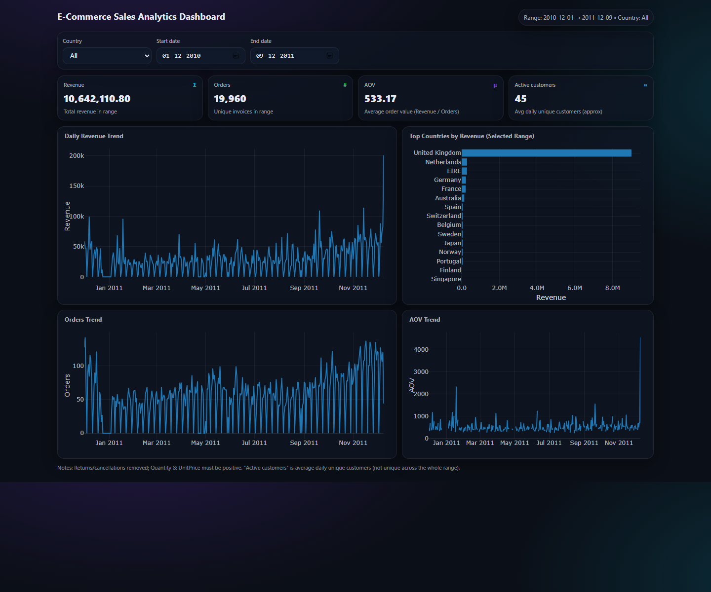

# E-Commerce Sales Analytics Dashboard



An interactive sales analytics dashboard for an online retail dataset. The project turns cleaned transaction data into a browser-based dashboard that helps track revenue, order volume, average order value, customer activity, country performance, and business trends.

[](https://developer.mozilla.org/en-US/docs/Web/HTML)
[](https://developer.mozilla.org/en-US/docs/Web/CSS)
[](https://developer.mozilla.org/en-US/docs/Web/JavaScript)
[](https://plotly.com/javascript/)

## Overview

This dashboard was built to make e-commerce performance easier to monitor and communicate. It combines KPI cards, date filters, country filters, and interactive visualizations so users can quickly move from a high-level sales summary to country-level trends.

The repository also includes a PDF analytics report with deeper analysis, customer segmentation, forecasting, and business recommendations.

## Project Snapshot

| Metric | Value |
| --- | ---: |
| Raw rows | 541,909 |
| Rows after cleaning | 524,878 |
| Time period | 2010-12-01 to 2011-12-09 |
| Total revenue | 10,642,110.80 |
| Total orders | 19,960 |
| Total items sold | 5,572,420 |
| Unique customers | 4,338 |
| Countries | 38 |
| Average order value | 533.17 |

## Dashboard Features

- KPI cards for revenue, orders, AOV, and active customers.
- Date range filters for focused time-period analysis.
- Country filter for regional performance analysis.
- Daily revenue trend visualization.
- Top countries by revenue ranking.
- Orders trend and AOV trend charts.
- Responsive dark UI built for quick scanning.

## Key Insights

- The United Kingdom contributes approximately 84.6% of total revenue.
- Revenue is highly concentrated among top customers: the Champions segment represents 1,317 customers and about 73.0% of revenue.
- Q4 shows strong seasonal sales activity, making it important for inventory planning and campaign timing.
- Weekly seasonality is visible in the revenue pattern, so forecast accuracy should be reviewed weekly.

## Analytics Report

The included report expands beyond the dashboard and covers:

- Data cleaning rules and quality notes.
- Descriptive statistics for quantity, unit price, and revenue.
- Revenue concentration by country.
- Top product performance.
- Day-of-week and hour-level sales patterns.
- RFM customer value segmentation.
- Daily revenue forecasting with ETS and seasonal naive comparison.
- Actionable business recommendations.

Open the report here: [report.pdf](report.pdf)

## Repository Structure

```text
.
|-- assets/
|   `-- dashboard-preview.png
|-- index.html
|-- report.pdf
|-- README.md
`-- .gitignore
```

## How To Run

Option 1: open `index.html` directly in your browser.

Option 2: run a local static server:

```bash
python -m http.server 8000
```

Then open:

```text
http://localhost:8000
```

## Data Cleaning Summary

- Removed exact duplicate rows.
- Excluded cancellations and returns.
- Excluded rows with non-positive quantity or unit price.
- Parsed invoice dates and created calendar-based features.
- Customer-level analysis uses rows with available `CustomerID`.

## Tools And Concepts

- HTML, CSS, and JavaScript for the dashboard interface.
- Plotly.js for interactive charts.
- KPI design and business intelligence reporting.
- RFM segmentation for customer value analysis.
- Time-series forecasting for daily revenue planning.

## Recommended Next Improvements

- Enable GitHub Pages to host the dashboard publicly.
- Add the source analysis notebook or script used to generate the report.
- Add the original dataset source and data dictionary.
- Add automated dashboard regeneration steps for future data refreshes.
